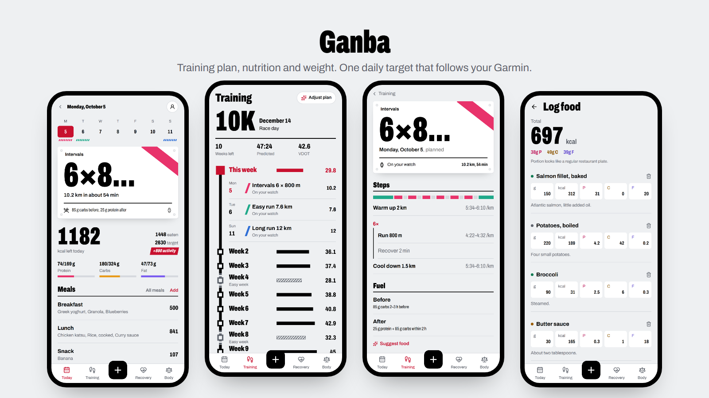
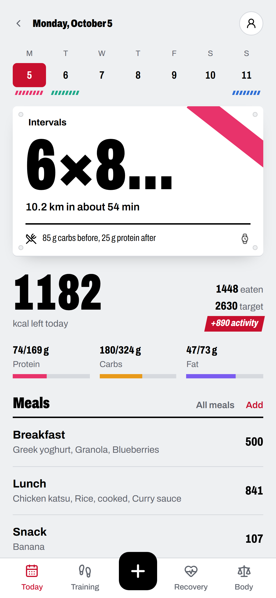
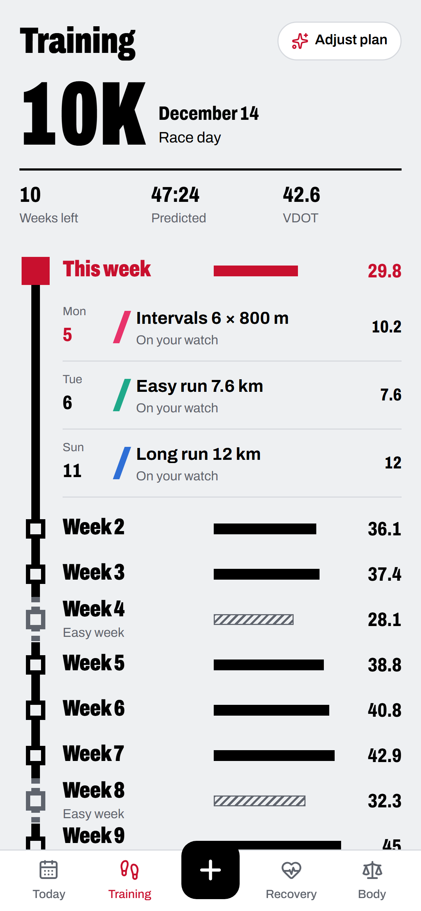
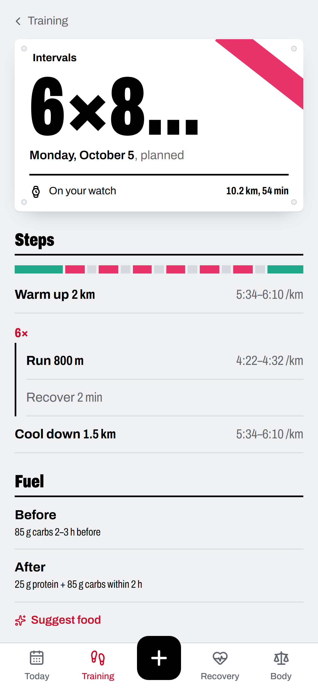
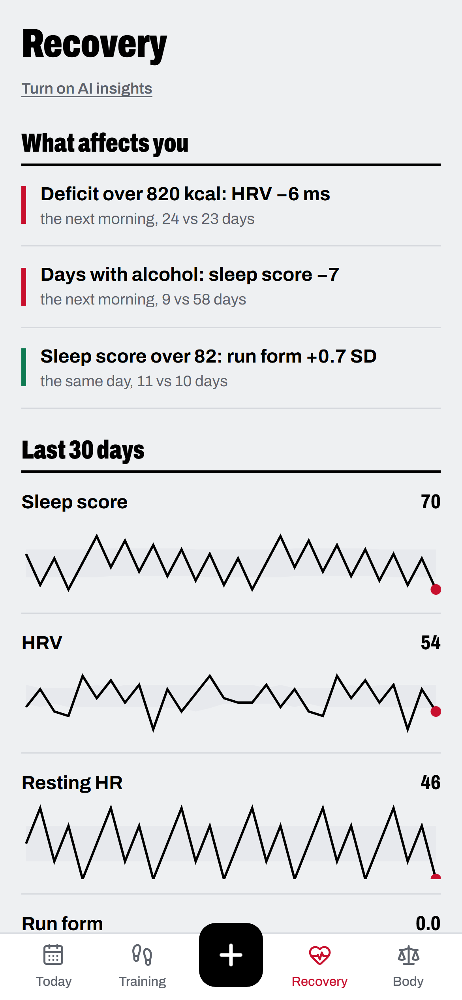
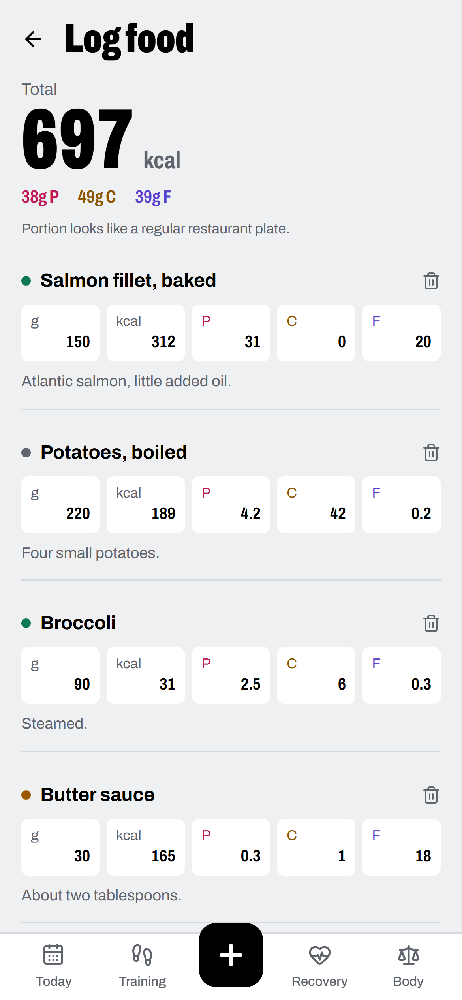
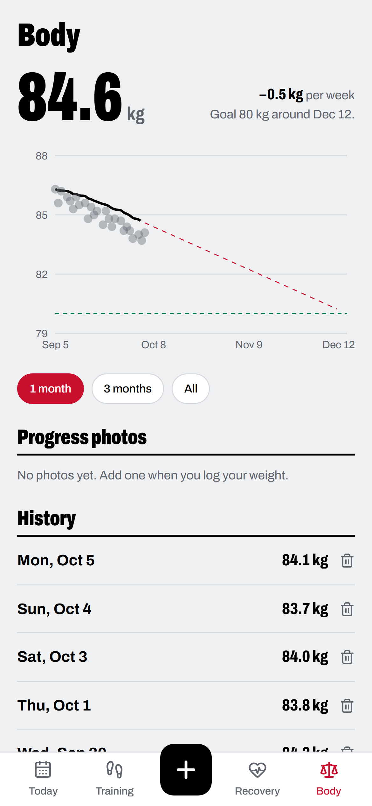
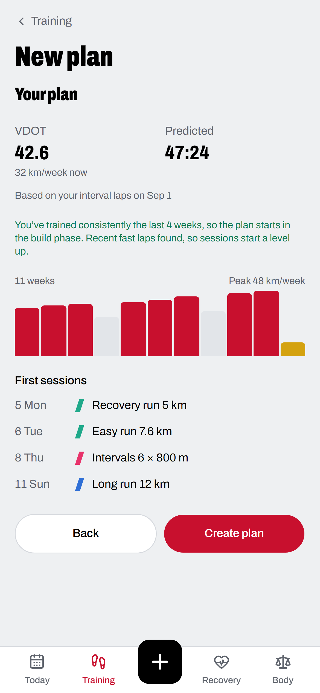

# Ganba

**One daily target that follows your training.**
A training plan, nutrition and weight tracking in one mobile web app, driven by your Garmin.

> *Ganba* (頑張って) is what Japanese runners shout to cheer each other on: "keep going, give it your all".

## Features

### Today
- Today's session as a race bib, with what to eat before and after.
- Calories left, macros, and how much today's activity added to your target.
- The week at a glance: which days you logged food and which sessions you ran.

### Nutrition and weight
- Log food from a photo or a short description. The app estimates grams, calories and macros, and you can correct it in plain text.
- Quick add when you already know the numbers.
- Trend weight that smooths out daily swings, with a forecast to your goal and private progress photos.
- A weekly check-in that adjusts your calorie target to what you actually burn.

### Training
- Plans for 5K, 10K, half marathon, marathon, or just building fitness, on the days you choose.
- Paces from your recent runs. Sessions are sent to your Garmin watch.
- The whole plan as a line map to race day, with weekly kilometres.
- Changes come as suggestions you accept: a missed session, new paces, a lighter week. You can also ask for changes in plain words.

### Recovery
- What affects your sleep, HRV and resting heart rate, and how your runs go: links found in your own data, each with the numbers behind it.
- Strict statistics first; links that only come from hard training days are filtered out.
- Optional AI on top (off by default): a weekly summary and "Why?" for a single day, citing only verified numbers.

### Garmin
- Steps, workouts, sleep and HRV sync automatically. Your daily target builds up through the day as you move.

## Screenshots

| Today | Training | Session | Recovery | Log food | Body | New plan |
|:---:|:---:|:---:|:---:|:---:|:---:|:---:|
|  |  |  |  |  |  |  |

## Plan

| Phase | Scope | Status |
|---|---|---|
| 1 | Nutrition, food logging from photos, weight trend, weekly check-in | Done |
| 2 | Garmin sync, activity-based daily target, training plan on the watch | Testing |
| 2 | New design ("Tasuki"), new logo, light and dark mode | Done |
| 2 | Recovery tab: links between food, training and sleep, optional AI | Done |
| Next | Weekly volume adapted to what you actually ran | Planned |
| Later | Strength and cycling in the plan, native app | Ideas |
