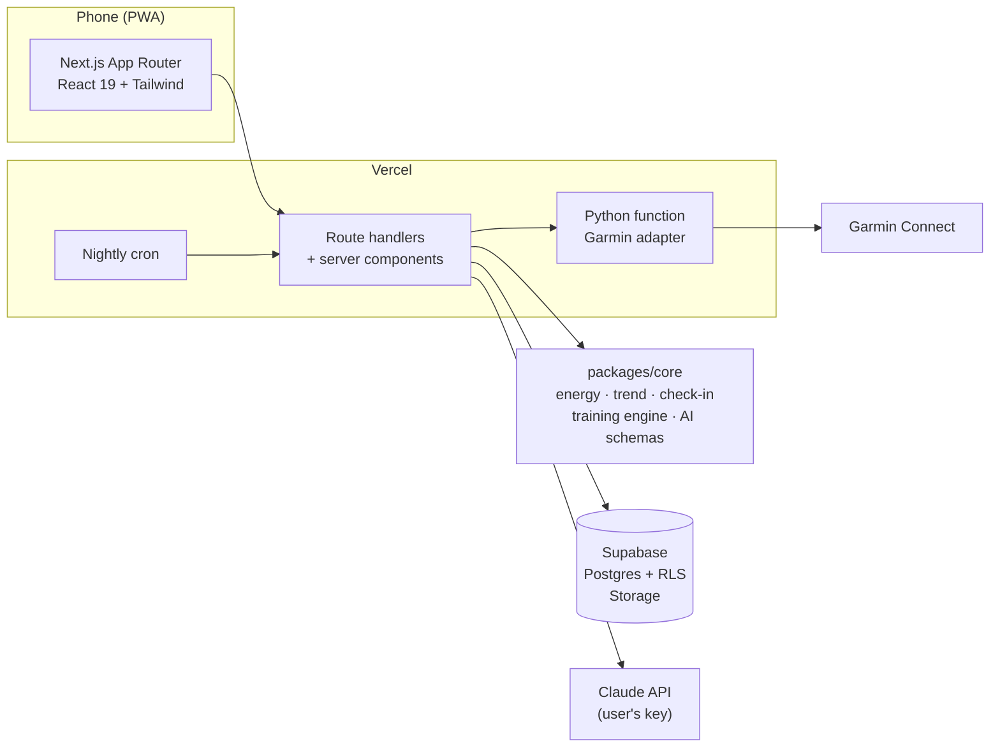

<div align="center">

# Loop

**One daily target that follows your training.**
A mobile-first web app that combines a Runna-style training plan with MyFitnessPal-style nutrition and weight tracking, driven by your Garmin.


</div>

> Working title. The app is a personal project in active development; the name will change.

## Why

Most apps do one half. Training apps plan your runs but don't know what you eat; nutrition apps count calories but treat a 20 km long run and a rest day the same.
Loop puts both in one place and keeps the effort for the user as low as possible: data comes from the watch and from a photo of your plate, not from forms.

## Features

### Nutrition and weight
- **AI food logging**: photo and/or text → items with grams, kcal, protein, carbs, fat (and alcohol), each with a confidence and the assumptions made. Correct it in plain text ("it was half a portion"). Uses Claude with your own API key.
- **Quick add** for when you just know the numbers; offline-safe drafts.
- **Trend weight**: an exponentially smoothed average of your weigh-ins, so daily water swings don't drive decisions. Weekly change, forecast to your goal, private progress photos.
- **Adaptive weekly check-in**: estimates what you actually burn from what you ate and how your trend weight moved, and proposes a new target (you accept or keep the old one).

### Garmin
- Connect once (MFA supported); only encrypted tokens are stored, never your password.
- Steps and workouts sync on app open, on pull-to-refresh and nightly.
- **Daily target builds up through the day**: passive base + activity so far (steps, runs, other sports, running steps not counted twice) + today's planned run − your goal deficit.

### Training plan
- **5K, 10K, half, marathon** or open-ended **build fitness**, on the days you choose, with your long-run day.
- Fitness (VDOT) from your best outdoor run, interval laps and Garmin's race predictor; paces for easy, marathon, threshold and interval work.
- Rule-based engine: phases (base, build, peak, taper), easier week every fourth, ≤ 10 % weekly growth, quality capped at ~30 % of the week, long run grows toward the goal distance. Consistent runners skip the base phase.
- **Sessions are sent to your Garmin calendar** as structured workouts (warm-up, reps, recoveries, target paces) for the next 14 days and kept in sync.
- Changes are always **proposals you accept**: missed key session → move it, faster recent runs → new paces, falling behind → lighter weeks.
- **Adjust with AI** in plain language ("my knee is sore, keep this week easy", "do Monday's session today and make it 1 km longer"). The engine checks every change against its rules.
- **Fueling around sessions**: carbs before, during (long runs) and protein after, scaled to you; optional AI food ideas based on what you have eaten today.

## Screenshots

| Today | Training | Session | AI food log | Body | New plan |
|:---:|:---:|:---:|:---:|:---:|:---:|
|  |  |  |  |  |  |

All screenshots use a generated demo account (`node scripts/screenshots.mjs`).

## How it works



- **`packages/core`**: pure TypeScript with no I/O. Energy model (Mifflin-St Jeor, activity from raw Garmin data), trend weight, weekly check-in, training engine (VDOT, plan generation, proposals, guard rails) and the AI output schemas. Reusable in a future native app.
- **`apps/web`**: Next.js 16 app, Supabase (row-level security on every user table), encrypted secrets (AES-256-GCM) in server-only tables.
- **Garmin adapter**: a small, stateless Python function using the community [`garminconnect`](https://github.com/cyberjunky/python-garminconnect) library. It only talks to Garmin; storage, encryption and logic stay in TypeScript, behind an interface that can be swapped for the official API later.

More detail: [concept spec](docs/specs/2026-09-29-fase1-konsept.md) · [phase 2 spec](docs/specs/2026-10-03-fase2-garmin-trening.md) · [decision log](docs/02-decisions.md) · [design tokens](docs/design.md) (docs are in Norwegian).

## Status and roadmap

| Phase | Scope | Status |
|---|---|---|
| 1 | Nutrition, AI food logging, weight trend, adaptive check-in | Done, in production |
| 2a | Garmin sync, activity-based daily target | Done, testing with a real account |
| 2b | Training plan, workouts on the watch, proposals, AI adjustments, fueling | Done, testing with a real account |
| Next | Weekly volume adapted to what you actually ran | Planned |
| Next | Own email sender and domain, new name | Planned |
| Later | Strength and cycling in the plan, recovery (sleep, HRV), native app | Ideas |

## Getting started

Requirements: Node 22+, pnpm, Python 3.11+ (for the Garmin adapter), a Supabase project.

```bash
pnpm install
cp .env.example apps/web/.env.local     # fill in Supabase keys and secrets (see comments in the file)
pnpm exec supabase link                 # once
pnpm db:push                            # apply migrations + regenerate DB types
pnpm dev                                # http://localhost:3000
```

Garmin adapter locally (optional):

```bash
python -m venv .venv
.venv/Scripts/pip install -r apps/web/requirements.txt   # macOS/Linux: .venv/bin/pip
.venv/Scripts/python apps/web/scripts/garmin-dev.py      # http://127.0.0.1:3200
```

## Tests

No unit tests by design; flows are covered end to end.

```bash
pnpm typecheck
pnpm test:int                          # Vitest against Supabase with throwaway users and a fake Garmin
node tests/smoke/training-smoke.mjs    # Playwright flows against a running app (also smoke, checkin-smoke, profile-smoke)
npx tsx evals/food/run.mts             # AI food-estimate eval (costs a few cents)
```

## Privacy and security

- Your Anthropic key and Garmin tokens are encrypted at rest and only readable by the server.
- Body photos are private and are never sent to AI.
- Every table is protected by row-level security; deleting your account removes your data and files.

## Disclaimer

Garmin access uses an unofficial library while official API access is pending. It may break when Garmin changes their login, and the app falls back to manual activity when it does. Not affiliated with Garmin, Strava, Runna or MyFitnessPal. Training and nutrition guidance is general and not medical advice.
